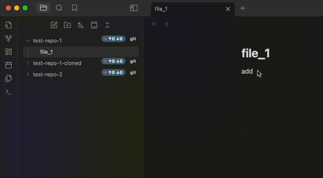

# Obsidian Git File Explorer

This plugin integrates Obsidian's file explorer with Git. Once the plugin is enabled, you will see relevant git information next to git repositories found in your vault in the file explorer.

## Features

### Git Changes Widget

- Number of changed files displayed next to each detected repository in the file explorer
- Clicking on the component prompts the user for a commit message (adjustable in the settings)
- After submitting, the component automatically stages and commits all changes in a single commit
- Option to automatically generate commit messages in the format "Backup @ {iso-timestamp}"

### Git Sync Widget

- Shows the number of commits to be pulled and pushed from the remote
- Upon clicking, a sync process is started: pull (--no-rebase) followed by push to remote
- Provides visual feedback of the sync status directly in the file explorer
- **Auto-sync feature**: Automatically synchronize repositories on a schedule
  - Configure auto-sync on startup to sync repositories when Obsidian starts
  - Set custom auto-sync frequency (in minutes) for periodic background synchronization
  - Visual indicator shows when auto-sync is active for a repository

### Git Diff Tool Integration

- Right-click context menu option to open the git diff tool for files and folders
- Easily visualize changes to files directly from the file explorer
- Works with any file or folder within a git repository
- Compatible with your system's default git diff tool

### File Explorer Enhancements

- Changed files can be highlighted in the file explorer with customizable styling
- Choose between colored text or margin highlight with colored text
- Visual indicators help quickly identify which files have uncommitted changes

### Repository Management

- Context menu option to initialize new Git repositories directly from the file explorer
- Automatically detects and monitors Git repositories throughout your vault

## Installation

1. In Obsidian, go to Settings > Community plugins
2. Disable Safe mode if it's enabled
3. Click "Browse" and search for "Git File Explorer"
4. Install the plugin and enable it

## Requirements

- Obsidian v0.15.0+
- Git must be installed and accessible in your system's PATH
- Plugin is desktop-only (not compatible with mobile)

## Configuration

Several options are available in the plugin settings:

- Toggle Git Changes Widget
- Toggle Git Sync Widget
- Enable/disable commit message prompts
- Configure visual styling for changed files
- Choose how changed files are highlighted in the file explorer

## Support

- Made by [Mateus Molina](https://blog.mmolina.me)
